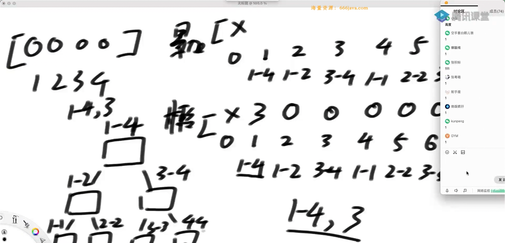

# 线段树

主要解决问题：区间上的 增加，区间上的 查询 ---> 时间复杂度是 `log(N)`

尊重传统：我们的数组是 从 0 开始

i 节点，他的父结点的位置是：`i/2`，左孩子节点`2 * i`，右孩子节点`2 * i + 1`（类似于完全二叉树）

- 准备多长的数组？4N
- 什么钱情况下最省空间： `2 ^ N`，如果有 4 个数据，他的索引是：大概是 N
- 什么时候最费空间？N 个数据，索引是 N。如果正好多出来的在树的右下角，那么前面都要进行填充，
  最下面一层是 `2*N`。加起来，结果就是 `4*N`

主打的就是一个：懒更新

比方说：我要：3 ~ 874 这个范围上的数据都 +1。
如果任务把范围全保住后：揽住。如果没有揽住，那么就向下分发

上图是：输入了指令`add 1-4, 3`。

如果要连续操作：`add 1-2, 4`。
新任务到来以后，看看有没有揽信息，揽信息没法合并，因为范围不一样，
那么就把之前的懒信息向下分发一层

## 落方块问题

##
