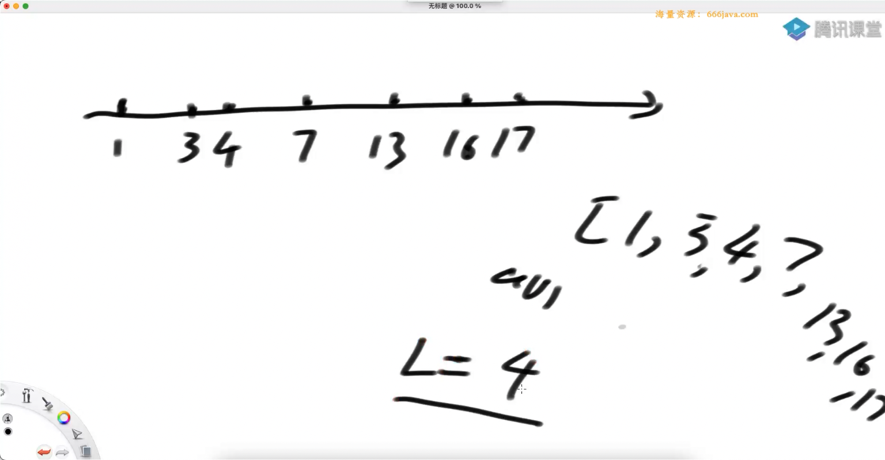
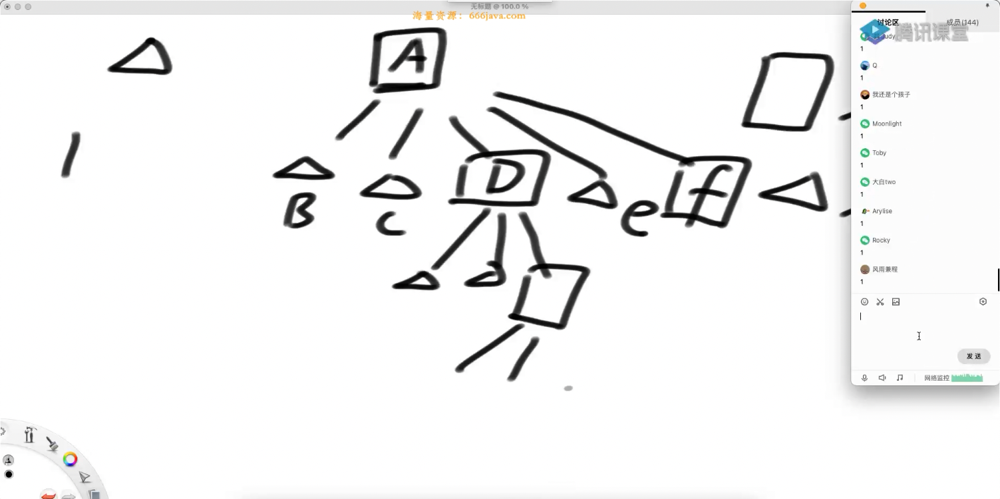
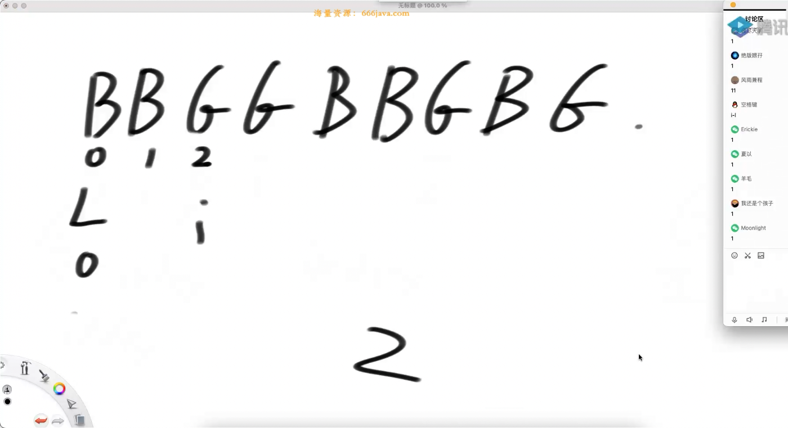
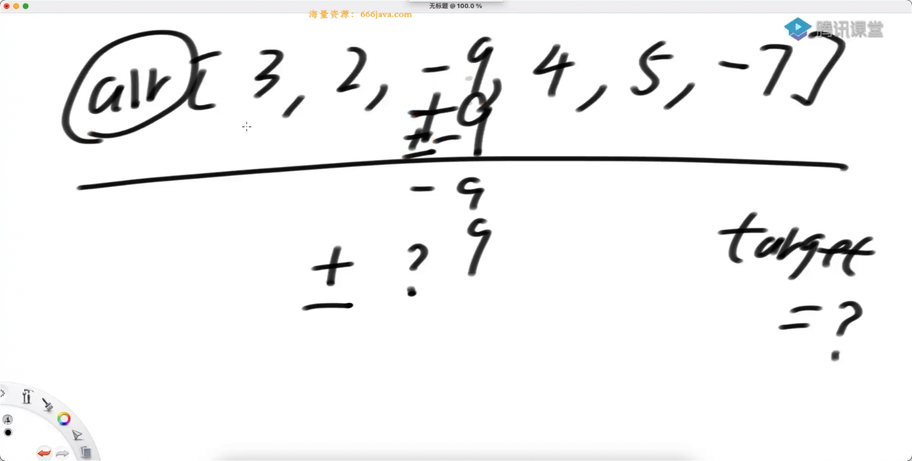

# day1

## 最大覆盖点

给定一个有序数组 arr，代表坐落在 x 轴上的点，
给定一个 正数 K，代表绳子的长度。
返回绳子最多能压中几个点？
即使绳子边缘处盖住点也算盖住



暴力：写出两个 for 循环来解决

首先我可以来一个小的贪心：绳子的末尾压在某一个点上

两种解法：

1. 二分查找

假设，右端是 973，左边是 873，那么二分：查找 873 与 973 中间有多少点，
然后这个点的坐标 放到一个数组中，有序的，可以用二分

```cxx
class Solution {
public:
    int maxPoint(std::span<int> arr, int L)
    {
        int res = 1;
        for (int i = 0; i < arr.size(); i++) {
            // arr[i] - L 表示： 绳子的右端放到 第 i 个点上，绳子左端能达到的距离
            // 看 最接近 value 的右边那个点的下标
            int nearest = nearestIndex(arr, i, arr[i] - L);
            res = std::max(res, i - nearest + 1); // 计算中间有多少个点，植树问题
        }
        return res;
    }

    int nearestIndex(std::span<int> arr, int R, int value)
    {
        int L = 0;
        int index = R;
        while (L <= R) {
            int mid = L + ((R - L) >> 1);
            if (arr[mid] >= value) {
                index = mid;
                R = mid - 1;
            } else {
                L = mid + 1;
            }
        }
        return index;
    }
};
```

这里的二分查找相当于是找一个：最近的向上取整

2. 滑动窗口

```cxx
class Solution {
public:
    int maxPoint(std::span<int> arr, int L)
    {
        int left = 0;
        int right = 0;
        int N = arr.size();
        int max = 0;
        while (left < N) {
            while (right < N && arr[right] - arr[left] <= L) {
                // 1. 还能往右加
                // 2. 绳子还够长
                right++;
            }
            max = std::max(max, right - left);
            left++;
        }
        return max;
    }
};
```

## 计算目录下的文件数量（树的遍历）

给定一个文件目录的算法，
写一个函数统计这个目录下的所有文件数量并返回。
隐藏文件也算，但是文件夹不算



不用递归的话：宽度优先（队列）

我的评价是：C++ NB

```cxx
class Solution {
public:
    unsigned int countFilesInDirectory(const fs::path& path)
    {
        unsigned int fileCount = 0;

        // 检查给定的路径是否存在以及是否为目录
        if (fs::exists(path) && fs::is_directory(path)) {
            // 遍历给定目录及其所有子目录
            for (const auto& entry : fs::recursive_directory_iterator(path)) {
                // 如果当前条目是文件，则增加计数器
                if (fs::is_regular_file(entry)) {
                    ++fileCount;
                }
            }
        }

        return fileCount;
    }
};
```

手动实现方式：

```cxx
class Solution {
public:
    int getFileNumber(const fs::path& folderPath)
    {
        // 检查路径是否存在以及它是目录还是文件
        if (!fs::exists(folderPath)) {
            return 0;
        }
        if (fs::is_regular_file(folderPath)) {
            return 1; // 如果是文件，直接返回1
        }

        std::stack<fs::path> stack;
        stack.push(folderPath);
        int files = 0;

        while (!stack.empty()) {
            fs::path folder = stack.top();
            stack.pop();

            // 使用异常处理来避免无权限访问时的程序崩溃
            try {
                for (const auto& entry : fs::directory_iterator(folder)) {
                    if (fs::is_regular_file(entry.status())) {
                        files++; // 是文件，则增加文件计数
                    } else if (fs::is_directory(entry.status())) {
                        stack.push(entry.path()); // 是目录，则将目录路径加入栈中
                    }
                }
            } catch (const fs::filesystem_error& e) {
                std::cerr << "Error accessing " << folder << ": " << e.what() << '\n';
            }
        }
        return files;
    }
};
```

## 不用循环

给定一个非负整数 num，
如何不用循环语句，
返回`>= num`，并且离 num 最近的，2 的某次方

```cxx
class Solution {
public:
    static int tableSizeFor(int n)
    {
        n--;
        n |= n >> 1;
        n |= n >> 2;
        n |= n >> 4;
        n |= n >> 8;
        n |= n >> 16;
        // 因为是 32 位 整数，所以只用 n |= n >> 16;
        // 这里相当于是：最高位一下的所有的位，全部变成 1
        return (n < 0) ? 1 : n + 1;
    }
};
```

C++ 的有符号整数的 `>>` 是：算术右移

## 相邻字符交换

一个数组中，只有两种字符 G 和 B，
想让所有的 G 都放在左边，所有的 B 都放在右边。
但是只能相邻的字符之间进行交换，
返回至少需要交换几次

（可以让 所有 G 在左边，或者所有 G 在右边）

最不行的做法：冒泡

贪心点：第一个 G 应该放到 0 位置，
第二个 G 应该放到 1 位置，
也就是：保持 每一个 G 的有序性，
没有必要：后面的 G 跑到 某一个 G 的前面



```cxx
class Solution {
public:
    static int minStep(std::string s)
    {
        if (s.empty() || s == "") {
            return 0;
        }
        const char* str = s.c_str();

        /* 看 G */
        int step1 = 0;
        int gi = 0;
        for (int i = 0; i < s.size(); i++) {
            if (str[i] == 'G') {
                step1 += i - gi;
                gi++;
            }
        }

        /* 看 B */
        int step2 = 0;
        int bi = 0;
        for (int i = 0; i < s.size(); i++) {
            if (str[i] == 'B') {
                step2 += i - bi;
                bi++;
            }
        }

        return std::min(step1, step2);
    }
};
```

## 计算（leetcode 494）

给定一个数组 arr，你可以在每个数字之前决定 + 或者 -，
但是必须所有数字都参数。
再给定一个数 target，请问最后算出 target 的方法数是多少？

我的想法：可能是一个背包问题。
取或者不取：也就是 + 或者 -



这道题是可以无视符号的：因为我们可以决定：+ 或者是 -

优化点：

1. 无视符号
2. 如果将所有的数加起来 sum，如果 target > sum，那么不会有答案 ---> 可以提前截断
3. target 与 sum 的奇偶性（加减 对 奇偶性的影响是一样的）不一样 ---> 截断
4. 取正数集合 P，取负数集合 N，题目要求 sum(P) - sum(N) = target ---> `p - n + p + n = target + p + n`
   ---> `2p = target + p + n` ---> `2p = target + sum` ---> `p = (target + sum)/2`，
   意味着：只要有一个集合 p 满足：`p = (target + sum)/2`，就意味着有一种方法。
   举个例子：{1, 2, 3, 4, 5} target = 3。此时：sum = 15，target = 3，那么 要求 p = (15 + 3) / 2 = 9，
   也就是求：和为 p 有多少种组合，可以不选择。那么就变成了一个：纯背包问题 ---> 缩小了：dp 表的规模（主要是 rest）
5. 状态压缩技巧：滚动数组，不用二维表了

## 最长的递增链长度（leetcode 392）

给定一个二维数组 matrix，
你可以从任何位置出发，走向：上下左右四个方向，
返回能走出来的最长递增链长度

我的评价是：暴力递归改动态规划

## 线段树的应用

给定两个 非负数组 x 和 hp，长度都是 N，再给定一个正数 range。
x 有序，`x[i]`表示 i 号怪兽 在 x 轴上的位置；`hp[i]` 表示 i 号怪兽的血量。
range 表示 法师如果站在 x 位置，用 AOE 技能攻击的范围是：`[x - range, x + range]`，
被打到的每只怪兽损失 1 点血量。返回要把所有怪兽的血量清空，至少需要释放多少次 AOE 技能

来一点贪心： 卡在最边缘处，放一次 AOE。没必要超出范围。

在一个范围上，所有的数字 -6，这就是线段树
