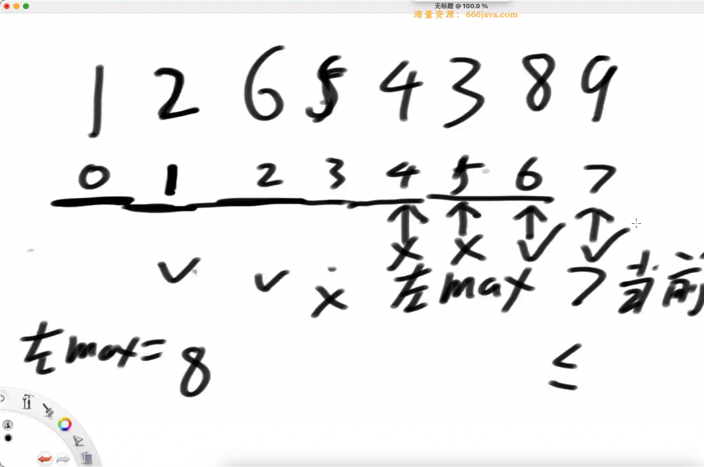
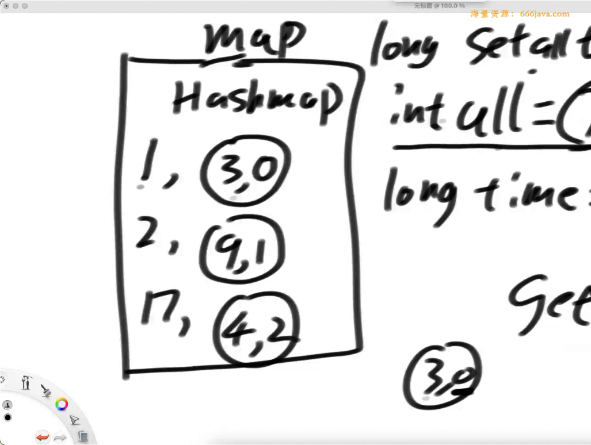
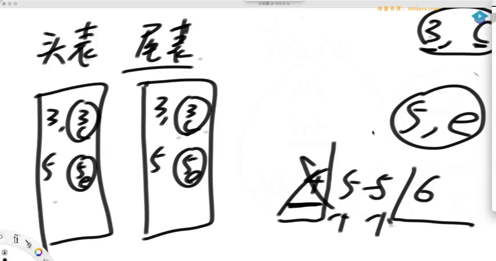

# day2

## getMoney 贪心

给定数组 hard 和 money，长度都为 N，
`hard[i]`表示 i 号的难度，`money[i]`表示 i 号工作的收入。
给定数组 ability，长度都为 M，`ability[j]`表示 j 号人的能力。
每一号工作，都可以提供无数的岗位（相同的工作，hard 和 money 都一样）。
但是 `人的能力必须 >= 这份工作的难度` 才能上班。
返回一个长度为 M 的数组 ans，`ans[j]`表示 j 号人能获得的最好收入

难度排序，收入大的排前面。删掉：相同难度，薪资小的（没必要）。
（这个有点 radix 排序的意思了）
下一次删除：难度增加，但是薪资变小或不变的（没必要）。
这样：难度与收入建立了单调性。
每次来一个人，那么就可以二分，找到最合适的工作。

当然，可以通过有序表完成上面的所有过程。

## 子数组排序

给定一个数组 arr，只能对 arr 中的一个紫薯组排序，
但是想让 arr 整体有序。
返回满足这一设定的 子数组，最短的是多长

`[7, 6, 2, 1, 0, 8, 9]`这个数组当然可以全部排，
但是实际上，我们只用排序`[7, 6, 2, 1, 0]`就行了



找到左边部分，最大的 max，如果需要更新 max，画 ❎ ，
如果不需要更新 max，画 ✅。 记录下最大下标的 ❎

找到 右边部分的 最小值 min，一样的。 找到 最小下标的 ❎。

连续的 ✅，代表：如果真的排序的话，不用给那些让位置

## 数据结构设计题

我想要给 hash 表增加一个方法：`setAll(value)`，
我想要让这个`setAll(value)`是`O(1)`的

给每条数据打上一个时间戳，打上时间戳的标签，比较。

`long setAllTime <- inf`



如果时间戳先于整体，那么就返回整体的

## 链路信息（数据结构设计题）

已知一个消息流会不断地吐出整数 1~N，
但不一定按照顺序一次吐出。
如果上次打印的序号位 i，那么当 i+1 出现时，
请打印 i+1 及其之后接收过的并且连续的所有数，
直到 1~N 全部打印完。请设计这种接受并打印的结构

链路信息，如果浏览器不做处理，那么就会导致：还没看到 呀咩得，就先看到了 `ki摸鸡`

首先，一定会接受 N 条数据（下标从 1 开始），
我们要求：算上内部调整的代价，时间复杂度是 `O(N)`

需要：头表、尾表、单链表（node.next）`Node(3, "c")`



连续区间`(4, 4)`，那么头表插入`4`，尾表插入`4`，
从尾表中，查出 以 3 结尾的连续区间，这个时候，区间`(3, 4)`连起来了，
那么原本的 以 3 为结尾 失效了，删除。以 4 为头删掉`(3, 3) --- (4, 4)` ---> `(3, 4)`。
这时候，看看`(3, 4)`是否有`(5, 5)`，在头表中删掉 5。

这个时候虽然头表、尾表中没有`(4, "d")`了，但是实际上被链表串起来了

## 可乐问题

贩卖机只支持硬币之父，且退钱都只支持 10，50，100 三种面额，
一次购买只能出一瓶可乐，且投钱和找零都遵循优先使用大钱的原则。
需要某买的可乐数量是 m，
其中手头拥有 10、50、100 的数量分别是：a、b、c。
可乐的价格是 x（x 是 10 的倍数），
请计算出需要投入硬币的次数？

这题不是 求最优解，而是单纯的模拟这个过程，但是这个数据量有`10^8`。

题目实际上是：一次一次投币。但是这样做的话，是比较慢的。
我们可以一次投很多币来优化

比方说：可乐 2500 元，然后 1000 元留下了一些历史信息

来到第 i 元的 第一瓶 是比较特殊的

看`p5.cxx`，这相当于是：将日常过程，通过工程的手段加速

### coding 技巧 ---> 向上取整

```cxx
            // TODO coding 技巧：(m + x - 1) / x ，加上一个 除数 - 1，就是向上取整
```

## 司机

现有司机 `N * 2` 人（偶数），调度中心会讲所有司机平分给 A、B 两个区域。
第 i 个司机去 A 可得收入为`income[i][0]`，去 B 可收入`income[i][1]`。
返回所有调度方案中能使所有司机总收入最高的方案

（个人想法：背包问题，感觉是可以找出一些数学规律啥的）
