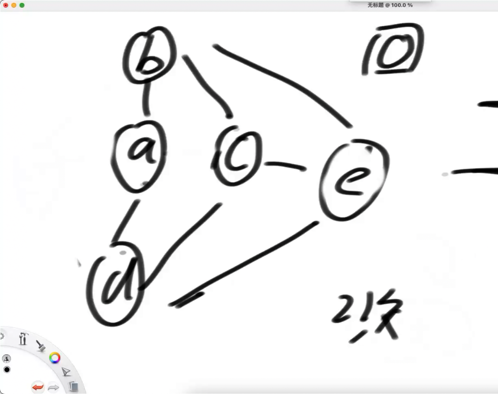
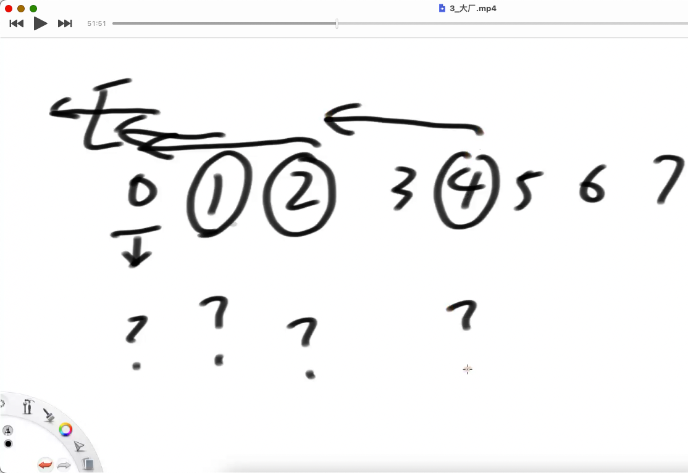
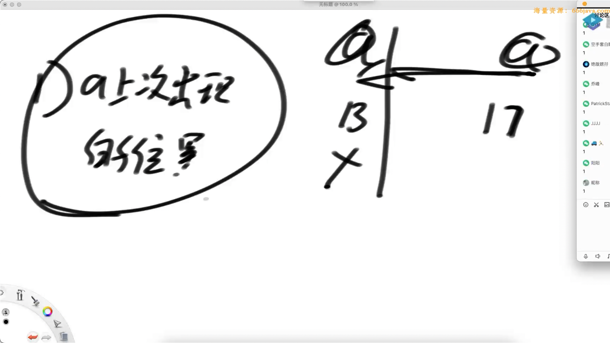
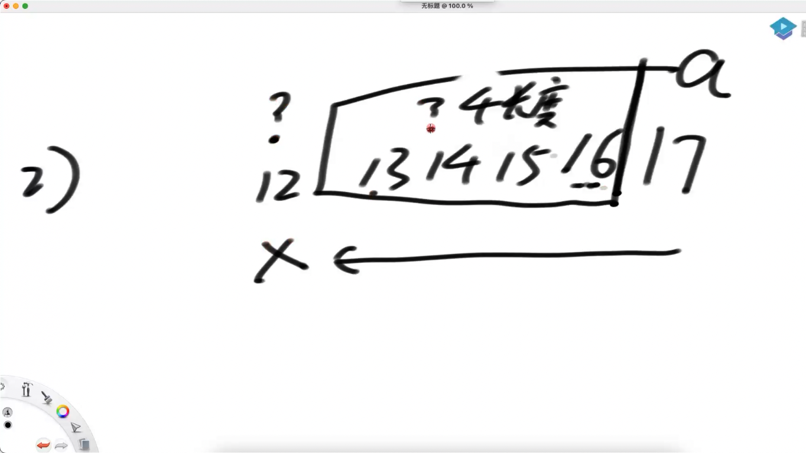
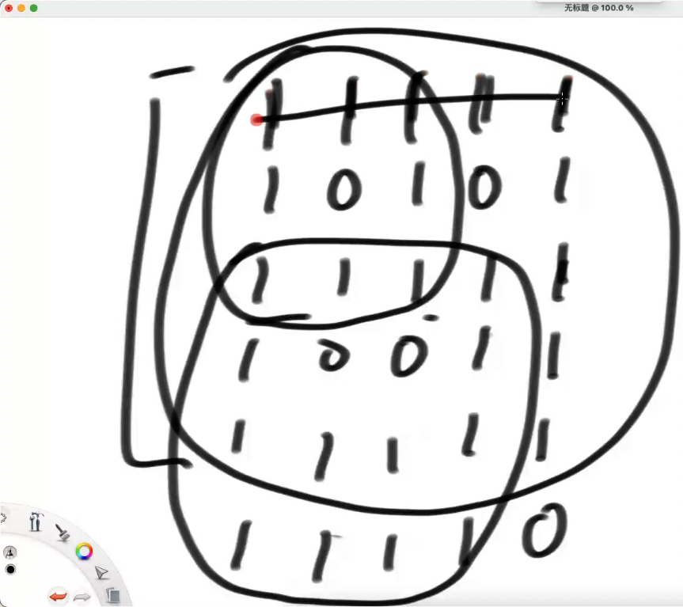
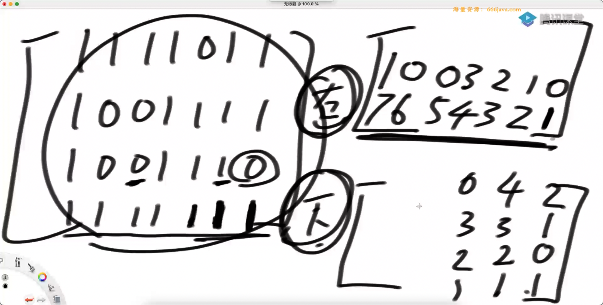
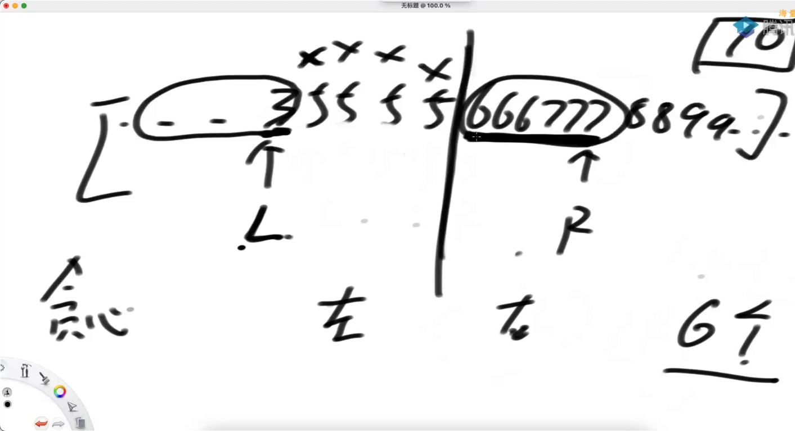
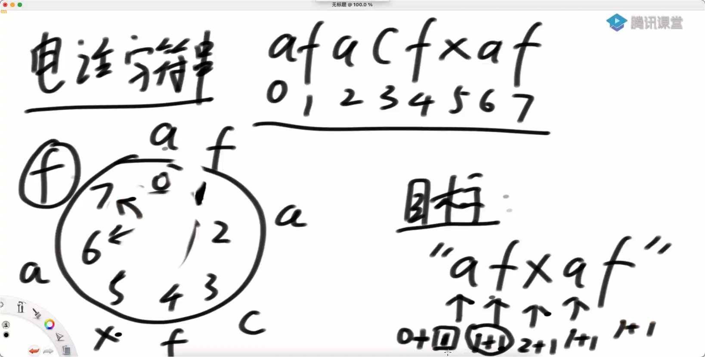

# day3

## distanceKNodes

给定三个参数：

二叉树的头节点 head，树上某个节点 target，正数 k 从 target 开始，
可以向上或者向下走。返回与 target 的 距离是 K 的所有节点

我的想法，这题没啥算法，直接递归完事儿了（当然要有父结点的指针），
然后还要保存一个东西：就是上一个位置的坐标，不走回头路。

1. 生成一个 父结点的 map
2. 就变成了一个图的 宽度优先遍历 了（通过一个登记表，来记录是否进入过队列）
3. 距离为 K，那么第 K 层队列，搜集结果就行了

两个点：

1. 生成 parents 的技巧
2. 宽度优先遍历

### coding 技巧：宽度优先 标记层次

获取：一批操作以后，队列的长度。
初始状态，队列的 size 一定是 1。那么我操作 1 次。



弹出一次以后，将周围的几点加入队列，加入完毕以后，统计队列大小为 2， 那么下一批只操作 2 次

```cxx
while (!q.empty()) {
	int size = q.size();
	while (size-- > 0) {
		Node* cur = q.front();
		q.pop();
		if (curLevel == K) {
			ans.push_back(cur);
		}
		if (cur->left != nullptr && !visited.contains(cur->left)) {
			visited.emplace(cur->left);
			q.push(cur->left);
		}
		if (cur->right != nullptr && !visited.contains(cur->right)) {
			visited.emplace(cur->right);
			q.push(cur->right);
		}

		// 如果有 父结点，并且父结点没被访问过
		if (parents.contains(cur) && !visited.contains(parents.at(cur))) {
			visited.emplace(parents.at(cur));
			q.push(parents.at(cur));
		}
	}
	curLevel++;
	if (curLevel > K) {
		break;
	}
}
```

## 滑动窗口

给定一个数组 arr 代表每个人的能力值。再给定一个非负数 k。
如果两个人的能力差值正好为 k，那么可以哦凑在一起比赛。
一句比赛只有两个人，返回最多可以同时有多少场比赛。

我的想法：遍历 + 二分查找，时间复杂度为 `O(NLogN)`。（错误的，因为是 最多）

暴力解：全排列，然后两个人划分为一组

这题是一个贪心：

1. 先排序
2. 窗口
   - `a - b < k`，R 右移
   - `a - b > K`，L 右移
   - `a - b = k`，比赛，标记比赛过了，同时右移
   - R 到了 最右边，L 右移。如果 `L == R == 最右边`，停止

可以使用桶排序

## 最长无重复子串（longest-substring-without-repeating-characters）

求一个字符串中，最长无重复子串的长度。

当然可以使用窗口来解决。

遍历每个字符，左侧推多远能不重复。（子串问题的经典思维）



决定因素：

1. 当前字符上次的位置



2. i-1 位置往左推的距离

如果 子串推不过去，那么 长串也推不过去



上面两个因素取 最小值

状态压缩，实际上只依赖了 i-1 位置，不一定需要整一个数组。

但是我的评价是：边界确实要扣准

##

只由小写字母`(a~z)`组成的一批字符串，都放在字符类型的数组 `string[] arr` 中。
如果其中两个字符串所函授的字符种类完全一样，就讲两个字符串算成一类。
比如：baacbba 和 bac 就算作一类，返回 arr 中有多少类？

想法：排序，去重，然后放到 hash 表中（很笨蛋）

我的想法：水桶。但是更高级的想法：bitmap（一个整数 32 bit，

```cxx
class Solution {
public:
    static size_t type(std::span<std::string> arr)
    {
        std::unordered_set<size_t> types;
        for (auto str : arr) {
            size_t key = 0;
            for (int i = 0; i < str.size(); i++) {
                key |= (1 << (str[i] - 'a'));
            }
            types.emplace(key);
        }
        return types.size();
    }
};
```

## 预处理技巧

给定一个只有 0 和 1 组成的二维数组，返回边框全是 1 的最大正方形面积



上图中，最后返回 `5 * 5 = 25`。

正方形有几种可能性：`O(N^3)`，顶点是 `O(N^2)`，边长是 `O(N)`

```cxx
template <int M, int N>
static int largestBorderedSquare(std::array<std::array<int, M>, N> m) // N * M 的矩阵，外层是 行
{

	for (int i = 0; i < N; i++) {
		for (int j = 0; j < M; j++) { // 枚举了 顶点的所有可能
			for (int border = 1; border <= std::min(N - i, M - j); border++) { // 枚举所有边长
				// 我希望能够验证边框 能不能用的话，这个过程时间复杂度是 O(1)
				// 想要知道正方形是否满足：我想要知道任何一个点 (i, j) 右方 下方 是否都是 1，(i + border, j) 右方，(i, j + border) 下方
				// 那么我可以先缓存了，缓存的时间复杂度不过是 O(N^2)
			}
		}
	}
}
```



缓存就类似于：前缀数组

## 贪心

给定一个正数数组，代表若干人的体重。
再给定一个正数 limit，代表所有船共同拥有的载重量。
每艘船最多坐两人，且不能超过载重量。
想让所有的人同时过河，并且用最好的分配方法让船尽量少。
返回最少的船数

1. 排序
2. 找到 `limit/2` 的区域
3. 从 `limit/2` 的分界位置，左右指针
4. L + R 搞不定，L 左移，左画 ❎
5. L + R 搞的定，L 左移，R 右移，左右画 ✅
6. 左侧先耗尽：最右边，单独一艘船。因为 ❎ 都在左边，因此：结果 = ❎ /2 + ✅/2 + 右侧剩下的人
7. 右侧先耗尽，那么左侧剩下的都 /2。结果 = ❎ /2 + ✅/2



## 分治法 不懂

给定一个数组 nums，选取 子序列。
子序列的和为 sum，找到 abs(sum - goal) 最小的结果。

暴力想法：组合问题，搜索，然后求和

数据范围：

`1 <= nums.size() <= 40`，`-10^7 <= nums[i] <= 10^7`，`-10^9 <= goal <= 10^9`，
如果用背包的话，肯定就爆内存了。

这里可以看到，是数个数比较少：分治（38 节 根据数据量猜解乏）

## 播电话 ☎ 号码

给一个电话字符串，例如：afacfxaf，播转轮的变化。



所有得到的：播转轮的代价，怎么让这个代价最低

从 i 到 j，怎么播最省？可以顺时针，可以逆时针
